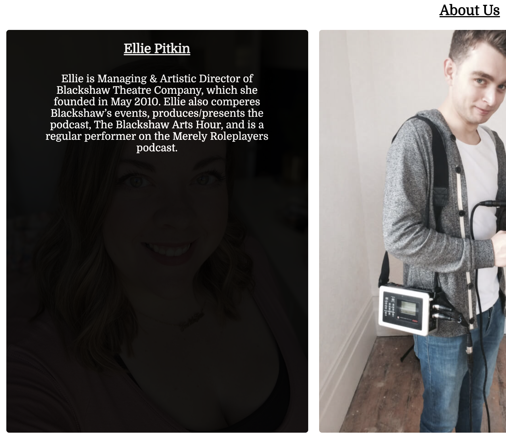

# Blackshaw Theatre
## Portfolio Project 1 - HTML/CSS

## Live Site

[Blackshaw Theatre](https://tom-ainsworth.github.io/blackshaw-theatre/)

## Repository

[Blackshaw Theatre Repository](https://github.com/Tom-Ainsworth/blackshaw-theatre)

***
## Contents
- [Purpose](#purpose)
- [Objective](#objective)
- [User Experience](#user-experience)
    - [User Stories](#user-stories)
    - [UXD User Experience Design](#uxd-user-experience-design)
- [Initial Plan](#initial-plan)
    - [Wireframes](#wireframes)
- [Features](#features)
    - [Current Features](#current-features)
    - [Features Left to Implement](#features-left-to-implement)
- [Technologies Used](#technologies-used)
- [Testing](#testing)
    - [Code Validation](#code-validation)
    - [Testing User Stories](#testing-user-stories)
        - [First Time Visitor Goals](#first-time-visitor-goals)
        - [Returning Visitor Goals](#returning-visitor-goals)
        - [Frequent User Goals](#frequent-user-goals)
    - [Further Testing](#further-testing)
    - [Lighthouse Results](#lighthouse-results)
        - [Mobile](#mobile)
        - [Desktop](#desktop)
- [Bugs](#bugs)
    - [Known Bugs](#known-bugs)
    - [Fixed Bugs](#fixed-bugs)
- [Deployment](#deployment)
    - [Github Pages](#github-pages)
- [Credits](#credits)
    - [Code](#code)
    - [Content](#content)
    - [Acknowledgements](#acknowledgements)
***

## Purpose

The purpose of this project is to demonstrate my ability in creating a static frontend appliction using the programming languages: HTML and CSS. I hope to create a working website that meets the needs of both user and client, by being easy to navigate and including all desired features.

## Objective

The objective of this site is to introduce new users to Blackshaw Theatre, and tell them a little bit about who Blackshaw are, and what they offer in terms of live performances.

Blackshaw Theatre currently have a [website](https://blackshawtheatre.wordpress.com/) made using wordpress, and Ellie Pitkin asked me to create a more sleek design to host the main features of the site.

The client would like the site to include:

- A brief description about what Blackshaw Theatre is
- The latest performances with links to purchase a ticket
- An About Us section with a brief introduction to the primary staff members.
- A contact form for any individials or businesses to get in touch for questions and collaborations
- Social media links to Blackshaw's pages on Facebook, Instagram and Twitter

## User Experience

-   ### User stories

    -   #### First Time Visitor Goals

        1. As a First Time Visitor, I want to easily understand the main purpose of the site and learn more about the organisation.
        2. As a First Time Visitor, I want to be able to easily navigate throughout the site to find content.
        3. As a First Time Visitor, I want to view the site on multiple devices at different times, and want the experience to be the same on all devices.

    -   #### Returning Visitor Goals

        1. As a Returning Visitor, I want to find out who is behind Blackshaw Theatre and what they do.
        2. As a Returning Visitor, I want to find the best way to get in contact with the organisation with any questions I may have.
        3. As a Returning Visitor, I want to find see what kind of presence they have on social media sites

    -   #### Frequent User Goals
        1. As a Frequent User, I want to check to see if there are any new shows out to see.
        2. As a Frequent User, I want to purchase tickets for the shows while still being able to come back to the site.
        3. As a Frequent User, I want to work with the company to produce a show, and speak with the owner directly.

-   ### UXD User Experience Design
    -   #### Colour Scheme
        -   I kept the colour scheme simple to aid accessibility. The current site used black and white, with an off white shade of #cdd0d4 used in the form section to allow it stand out from the background, while still being subtle.
    -   #### Typography
        -   Domine is the primary font used on the page, with Serif as a backup. Initially I chose Open-Sans as the font, with Domine as a backup/extra font, however I found that I wasn't changing the font on any areas of the page. As a result I chose to solely use Domine, as it is a lighter font than Open-Sans, and Serif is more widely available should Domine fail to render.
    -   #### Imagery
        -   The images used were from the client, and also [Pexels](https://www.pexels.com/) for the hero image, and Miss McSkimming show. The large, background hero image is designed to be striking and catch the user's attention. It features a theatre cast on stage under the lights, to evoke an emotive response of excitement and professionalism in the user. The dark image matches the colour scheme of the site well, contrasting with the logo at the top. The boat image is to give a little bit of context to the show it relates to, and help the user envisage the scene. About section features high resolution images of the relevant staff member.

## Initial Plan

 At the start of the project, the plan was to create a multi page site split into the sectons required by the client seen [here](assets/readme-content/wireframes.md). After further consultion with my mentor Antonio Rodriguez, we agreed that a mobile first would be a more appropriate method, as it means less clicking for the user, quicker load times for the page, as I wouldn't have to keep repeating header and footer code. This change work well for the client too.
 
 The mobile wireframes are the final idea, and then the desktop site was built around this design.

### Wireframes

[Wireframes - Seperate document](assets/readme-content/wireframes.md)

I have included both mobile and desktop wireframes to demonstrate the progression in the project. As you can see, the core elements remain for both sets, but the layout is far closer to the mobile wireframes than desktop.

Though tablet wireframes were not made seperately, I knew that by having a mobile first approach, I would be able to scale the site up to tablet sizes relatively easily.

## Features

[See All Features](assets/readme-content/features.md)
### Current Features

1. The navigation bar is central and at the top of the page on all devices. It lays out the flow of the page and links smoothly to the appropriate section.

1. The colour scheme has been chosen to maximise contrast between foreground and background elements. Where text is features over an image, an overlay or background has been applied to make it more visible.

1. The description section tells the user briefly what it is that the company does, leaving no guess work.

1. Buttons have been added around relevant elements to encourage the user to interact with the site. The button changes on hover to let the user know it is clickable.

1. The shows section has a matching image with information where possible to draw the user into the section.

1. The about section has a text overlay effect on hover for each image, allowing the user to interact and choose the information they wish to view.

1. The contact form allows users to get in touch the Blackshaw Theatre, and stands out from the rest of the site, with inverted colours.

1. The submit button at the botton of the contact form stands out, encouraging users to complete and send the form. It has a hover effect, and an animation when pressed.

1. The footer contains social links that open in a new tab, with a nopener property for added userr security.

### Features Left to Implement

1. I would like to add a blog page, within the site, with a maintainable layout that can be easily edited or replicated for new entries.
1. The hero image could be a slideshow of images, or a video of Blackshaw in action, increasing user retention.
1. 
## Technologies Used

1. [Pexels](https://www.pexels.com/)
    - Pexels was used for royalty free images seen in the Hero Image and Shows sectons.
1. [Google Fonts:](https://fonts.google.com/)
    - Google fonts were used to import the 'Domine' font into the style.css file which is used throughout the project.
1. [Font Awesome:](https://fontawesome.com/)
    - Font Awesome was used for the footer social media icons.
1. [GitHub:](https://github.com/)
    - GitHub is used to store the projects code after being pushed from Git.
1. [TinyPNG:](https://tinypng.com/)
    - TinyPNG was used to compress image file sizes.
1. [Balsamiq:](https://balsamiq.com/)
    - Balsamiq was used to create the [Wireframes](assets/readme-content/wireframes.md) during the design process.

## Testing

### Code Validation

The W3C Markup Validator and W3C CSS Validator Services were used to validate every page of the project to ensure there were no syntax errors in the project.

-   [W3C Markup Validator](https://validator.w3.org/#validate_by_uri) - [Results](https://validator.w3.org/nu/?doc=https%3A%2F%2Ftom-ainsworth.github.io%2Fblackshaw-theatre%2F)

-   [W3C CSS Validator](https://jigsaw.w3.org/css-validator/) - [Results](https://jigsaw.w3.org/css-validator/validator?uri=https%3A%2F%2Ftom-ainsworth.github.io%2Fblackshaw-theatre%2F&profile=css3svg&usermedium=all&warning=1&vextwarning=&lang=en)

    - 6 Warnings were found, with 4 relating to the nav bar border colour being the same
        - 4 warnings about the nav bar border colour being the same as the background. This was due to the hover effect and so was not a concern.
        - 2 warnings were related to code applied to placeholder colour, necessary when using the website in various browsers. I was also happy with this code being included.
    

### Testing User Stories

-   #### First Time Visitor Goals

    1. As a First Time Visitor, I want to easily understand the main purpose of the site and learn more about the organisation.

        1. Upon entering the site, users are automatically greeted with a clean and easily readable navigation bar to go to the page of their choice. Underneath there is a Hero Image with Text and a brief description about the company.
        2. The main points are made immediately with the hero image
        3. Beneath the description are 2 calls to actions, users can find out more, or get in touch. With the fold displaying more content to encourage scrolling. 

    2. As a First Time Visitor, I want to be able to easily be able to navigate throughout the site to find content.

        1. The site has been designed to be fluid, with a clear navigation bar with links to all sections of the page. 
        2. As mentioned, the call to action buttons are strategically placed between sections to give users something to interact with.
        3. On the Contact Us Page, after a form response is submitted, the submitted form loads on a seperate tab, so the user can go straight back to the site should they wish.

    3. As a First Time Visitor, I want to view the site on multiple devices at different times, and want the experience to be the same on all devices

        1. I created media queries to keep the user experience the same on the vast majority of screen sizes, with responsive text and images throughout.
        2. I added column-counts for tablet and desktop screen sizes to minimize scrolling, and display relevant content in the correct order. No sections overlap so the information heirarchy isn't disturbed.
        3. I added multiple hero image files depending on the screen width. I wanted the hero image to be appropriately sized as it is the first thing users see when the open the site.

-   #### Returning Visitor Goals

    1. As a Returning Visitor, I want to find out who is behind Blackshaw Theatre and what they do.

        1. The Tell Me More call to action takes users straight to the About section for quick access.
        2. All of the About images display info about the respective staff member when hovered over, empowering users to see the information they want. This also draws focus to the individual to help users concentrate on what they're looking at.

    2. As a Returning Visitor, I want to find the best way to get in contact with the organisation with any questions I may have.

        1. Below each show is a call to action to "get in touch" which takes the user to the contact section of the page.
        2. The whole site has a white background, apart from the contact form. This change of colour creates an emotive response for the user that the interaction on the page has changed, from viewing content, to submitting their own content.
        3. The footer contains social media links to Blackshaw Theatres pages. Some users are more familiar with communicating through these sites rather than via email, and so may choose to message through there. All links open in seperate tabs to keep focus on the main site.

    3. As a Returning Visitor, I want to find see what kind of presence they have on social media sites
        1. As mentioned above, should a user wish to simply browse the socials, they have the option to do so with the footer links.

-   #### Frequent User Goals

    1. As a Frequent User, I want to check to see if there are any new shows out to see.
        1. I changed the navigation bar name from "what's on" to "shows" during the site creation. This saved space on smaller screen sizes, allowing the nav bar to remain on one line, and also made it crystal clear what the section was relating to.
        2. Every show on the site is listed with the same format, making users feel comfortable and in control as they browse the site. This also allows future shows to be easily added or edited by another contributor.
        3. All shows include a link to the contact form in case users want to find out more.

    2. As a Frequent User, I want to purchase tickets for the shows while still being able to come back to the site
        1. Next to the "get in touch" button is a link to the relavent page to purchase tickets for the show. All of these pages are trustworthy, and users can feel safe being directed by Blackshaw for their own shows, rather than searching through 3rd party sites.

    3. As a Frequent User, I want to work with the company to produce a show, and speak with the owner directly.
        1. Throughout the page are CTA's linking to the contact form, and a specific input for businesses/companies to tell Blackshaw who they are.
        2. In the about section, users are introduced the the owner of Blackshaw Ellie, who managed the emails and social medias herself. When she replies to users they will feel safe knowing they are talking tot the owner, rather than someone else in the company.

### Further Testing

-   The Website was tested on Google Chrome, and Safari on iOS and iPadOS.
-   The website was tested on Chrome, Safari and Firefox on laptop and desktop.
-   The website was viewed on a variety of devices such as Desktop, Laptop, iPad, iPad Pro, iPhone7, iPhone X, iPhone SE & iPhone 12.
-   A large amount of testing was done to ensure that all pages were linking correctly.
-   Friends and family members were asked to review the site and documentation to point out any bugs and/or user experience issues.
-   I tested the page using GoogleDev Tools Lighthouse feature on both mobile and desktop settings

### Lighthouse Results

#### Mobile

#### Desktop

## Bugs

### Known Bugs
-   When reducing the site from around 1775px to 1575px, the About section images overlap slightly. The screen sizes I tested the site on do not show this at all, I only noticed it when manually dragging the screen down through these dimensions, as seen here:

### Fixed Bugs
- At first the hero image was set within HTML based on mobile device sizes. When it came to making the site responsive, I found it difficult to implement the picture element, and so opted to change this to a background image within CSS. This gave me far more flexibility to style the image, and meant that I could swap the image out with media queries, making the site look much better on all screen sizes.

- The overlay was causing me issues on the about section. I knew that I wanted to implement it quite early on, as I found it while researching image tags on [W3Schools](https://www.w3schools.com/howto/howto_css_image_overlay.asp). Tweaking the CSS properties from the code given took a lot of experimenting, as the positioning was very important to maintain the look of the site. As there are several class selectors, I needed to ensure I was calling the correct HTML, as my class names were different to that of the tutorial. I wanted to make this feature repeatable within a container "staff-bio" in case the client wanted to add any more staff members. At first I had indiviual height and width values for all selectors, however later decided to add inherited values to help with site maintainence.

- As I knew the site would be scaled up, I tried to make all text responsive from the get go, using the vw property to unify all elements of the same type. This worked quite well for mobile and tablet, but meant that desktop text was far too large. I researched more standardised sizings and noticed that major sites such as Apple, Facebook and Youtube had very similar pixel values for the relative elements. After adding these to media queries, and adjusting the primary sizing, the page looked far better when resizing the screen.

## Deployment

### GitHub Pages

The project was deployed to GitHub Pages using the following steps...

1. Log in to GitHub and locate the [GitHub Repository](https://github.com/Tom-Ainsworth/blackshaw-theatre)
2. At the top of the Repository (not top of page), locate the "Settings" Button on the menu.
    - Alternatively Click [Here](https://pages.github.com/) for a page with instructions on how to use Github Pages
3. Scroll down the Settings page until you locate the "GitHub Pages" Section.
4. Under "Source", click the dropdown called "None" and select "Main".
5. The page will automatically refresh.
6. Scroll back down through the page to locate the now published site [link](https://tom-ainsworth.github.io/blackshaw-theatre/) in the "GitHub Pages" section.

## Credits

### Code

-   The full-screen hero image code came from this [Pexels page](https://www.pexels.com/photo/silhouette-photography-of-people-on-theater-1714361/)

-   [W3Schools](https://www.w3schools.com/) : For various tutorials and explanations of properties. 
    - Code was used and adapted from [This Tutorial](https://www.w3schools.com/howto/howto_css_image_transparent.asp) for the text overlay on the hero image.
    - Code was used and adapted from [This Tutorial](https://www.w3schools.com/howto/tryit.asp?filename=tryhow_css_image_overlay_fade) for the Overlay images in the About Section
    - Code was used and adapted from [This Tutorial](https://www.w3schools.com/howto/howto_css_placeholder.asp) to change the placeholder colour within form inputs on various browsers.
    - Code was used from [Google Fonts](https://fonts.google.com/) to import the font family within my CSS file.
    - Code was used from [Font Awesome](https://fontawesome.com/) to add social media links in the footer.

### Content

-   All code was written by the developer.

-   README.md Template courtesy of Code Instite, with layout inspiration from [Dave Horrocks](https://github.com/DaveyJH/ci-portfolio-one-v4)

### Acknowledgements

-   My Mentor for continuous helpful feedback.

-   The September 2021 Slack group for constant support for one another and bumps when feeling overwhelmed.

-   Fellow CI student Dave Horrocks for quick and incredibly helpful tips on several occasions, and for providing an inspiring project to work towards.