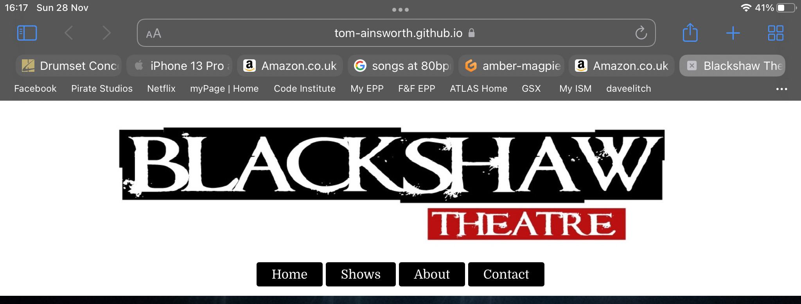
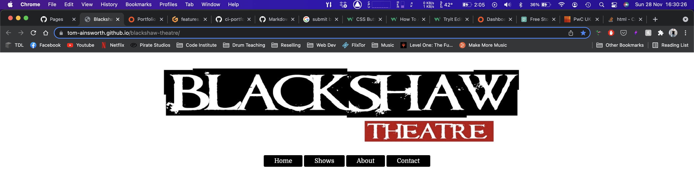

# Features

[Return to main README](../../README.md)

## Contents

- [Navigation Bar](#navigation-bar)
- [Description](#description)
- [Call to Action Buttons](#call-to-action-buttons)
- [Shows](#shows)
- [About Overlay](#about-overlay)

## Navigation Bar

### iOS

#### iPhone SE

#### iPhone 12

### iPadOS

### Laptop

## Description

## Call to Action Buttons

## Shows 

## About Overlay

### iPhone 12

### Ipad Pro

### Laptop

## Contact

## Submit Button

### Hover

### Click

## Footer
